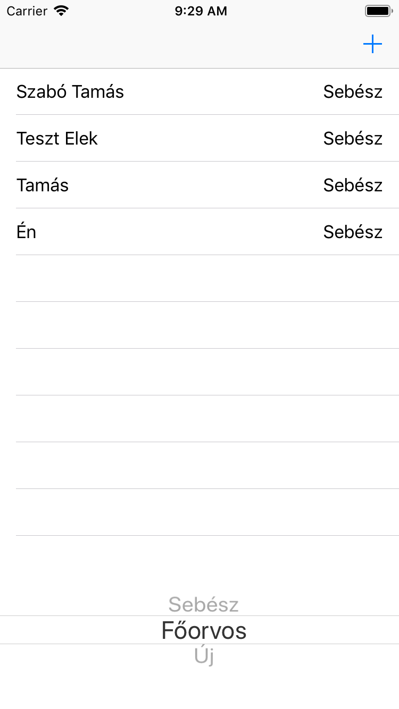
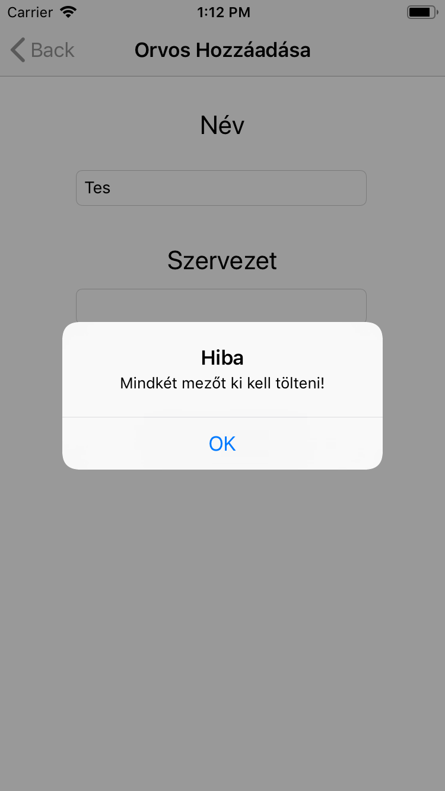
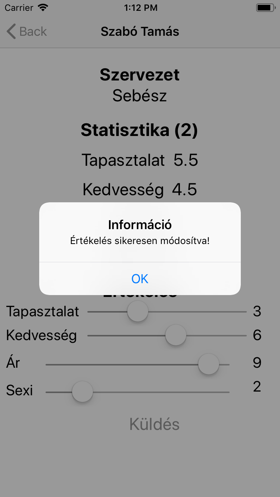
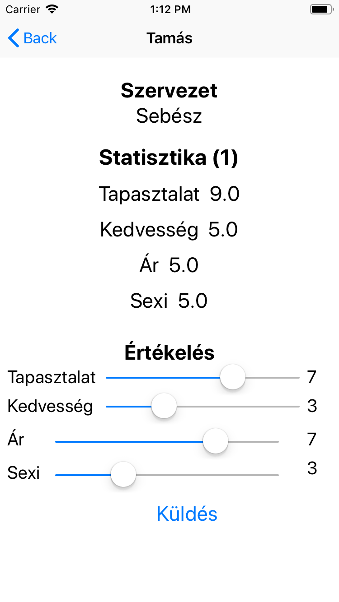

 # MarkMyDoctor - Orvos értékelő app
 Leírás:
 Az orvosok értékelésére számos felület található, azonban nincs egységes adatbázis ezek összegyűjtésére. Mindenki szeretne a legjobb orvoshoz kerülni, amely ár-érték arányban a legmegfelelőbb. A cél egy ilyen egységes adatbázis összeállítása lenne, ahol különböző szempontok alapján rendezhetőek az orvosok szakterületek szerint külön kezelve őket.

 ## Funkciók
 * Orvos hozzáadása
 * Orvos értékelése
 * Orvosok kilistázása szervezetek szerint

### Tervezett funkciók
* Orvosok rendezése az értékelések alapján
* Online elérhetőség

### Telepítés/Futtatás
Az adatbázis eléréséhez mindenképp szükséges egy npm install a backend mappában majd node-dal a szerver futtatása (localhost). Ezután xcode seg0tségével le kell buildelni a swift programot és virtuális iPhone-on elindítani.

### Fejlesztő
* Szabó Tamás
* h775260@stud.u-szeged.hu / szabotomika97@gmail.com

## Képernyőtervek
 
 

